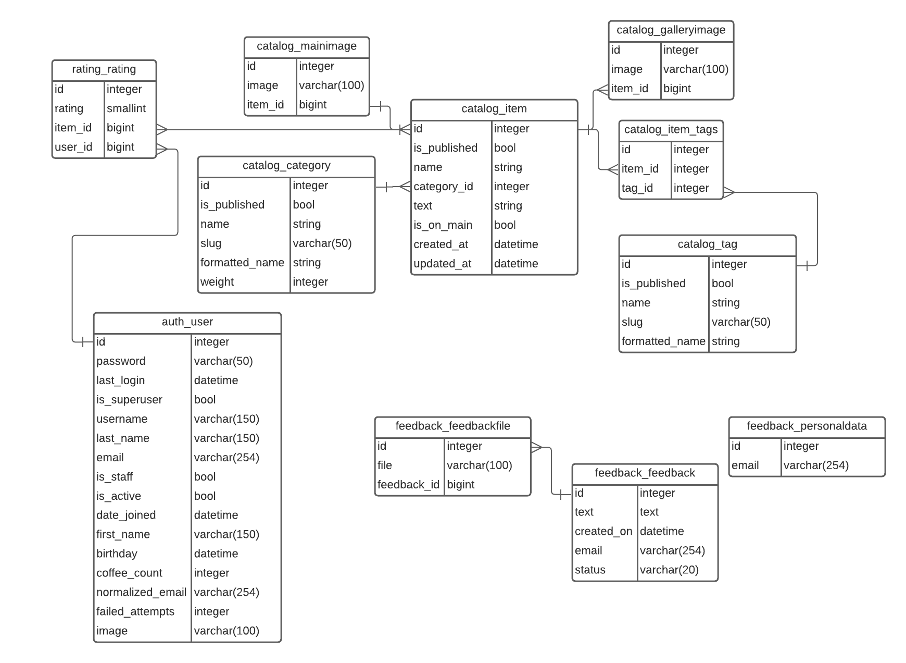

[](https://github.com/F0RRZZ/django-homework/actions/workflows/python-linting-tests.yml)
[](https://github.com/F0RRZZ/django-homework/actions/workflows/django-tests.yml)

# django-homework
---

#### ! Для того, чтобы проделать представленные шаги на Windows, необходимо установить git bash!
[Git Bash](https://gitforwindows.org/)

---

1. Клонируем репозиторий

```shell
git clone https://github.com/F0RRZZ/django-homework.git
```

---

2. Создаем и активируем venv

Windows:
```shell
cd django-homework
python -m venv venv
source venv/Scripts/activate
```


Linux/MacOS:

```shell
cd django-homework
python3 -m venv venv
source venv/bin/activate
```

---

3. Устанавливаем зависимости
---
* Основные зависимости:

Windows:

```shell
pip install -r requirements.txt
```

Linux/MacOS:

```shell
pip3 install -r requirements.txt
```

---
* Зависимости для разработки

Windows:

```shell
pip install -r requirements-dev.txt
```

Linux/MacOS:

```shell
pip3 install -r requirements-dev.txt
```

---
* Зависимости для тестов

Windows:

```shell
pip install -r requirements-test.txt
```

Linux/MacOS:

```shell
pip3 install -r requirements-test.txt
```

---

4. Переменные окружения

Чтобы создать и отредактировать переменные окружения, сначала пройдите по пути:

```shell
cd homework/
```

В данной директории находится тестовый .env (.env.example)
Чтобы создать .env, введите команду:

```shell
cp .env.example .env
```

Готово. Теперь в этой директории находится .env, который можно отредактировать
при необходимости.

---
## Создание базы данных с нуля
5. Миграции

Для миграции необходимо ввести следующие команды:

Windows:

```shell
python manage.py makemigrations
python manage.py migrate
```

Linux/MacOS:

```shell
python3 manage.py makemigrations
python3 manage.py migrate
```

Также можно загрузить в базу данных тестовые данные из фикстуры data.json:

Windows:

```shell
python manage.py loaddata data.json
```

Linux/MacOS:

```shell
python3 manage.py loaddata data.json
```

Схема получившейся базы данных:



Ссылка: https://lucid.app/lucidchart/ab3a9b1e-eebe-435a-a6ec-1b93c61f332e/edit?viewport_loc=13%2C-132%2C2663%2C1348%2C0_0&invitationId=inv_b50f7bd1-76d0-4f80-bfe8-f136843089f3

---

6. Создание пользователя с админским доступом

Для того, чтобы создать суперпользователя, введите следующие команды:

Windows:

```shell
python manage.py createsuperuser
```

Linux/MacOS:

```shell
python3 manage.py createsuperuser
```

Затем введите запрошенные данные.

---

## Тестовая база данных

Вы также можете воспользоваться тестовой базой данных

Для этого вам нужно скопировать db_example.splite3

```shell
cp db_example.sqlite3 db.sqlite3
```

В базе данных присутствует тестовый суперпользователь

Имя: `admin`

Пароль: `admin`

---

7. Запускаем сервер

Windows:
```shell
python manage.py runserver
```
Linux/MacOS:
```shell
python3 manage.py runserver
```
